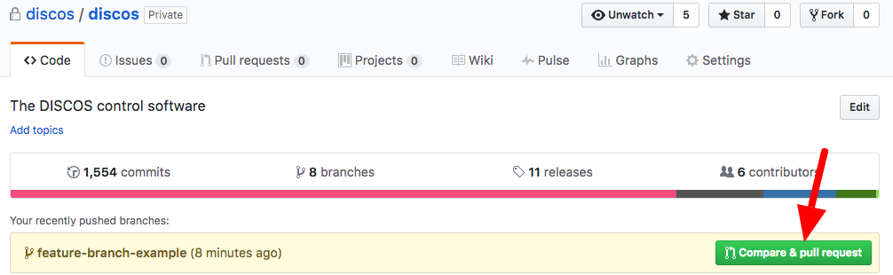
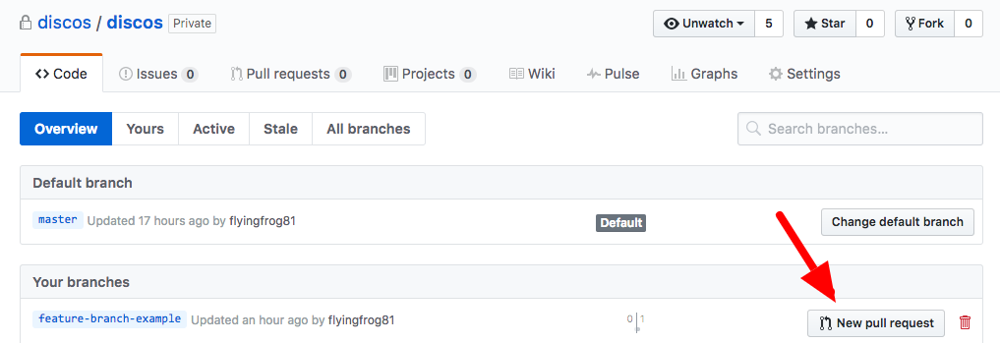
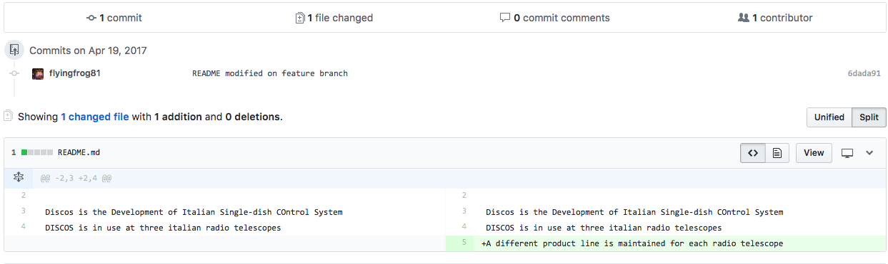
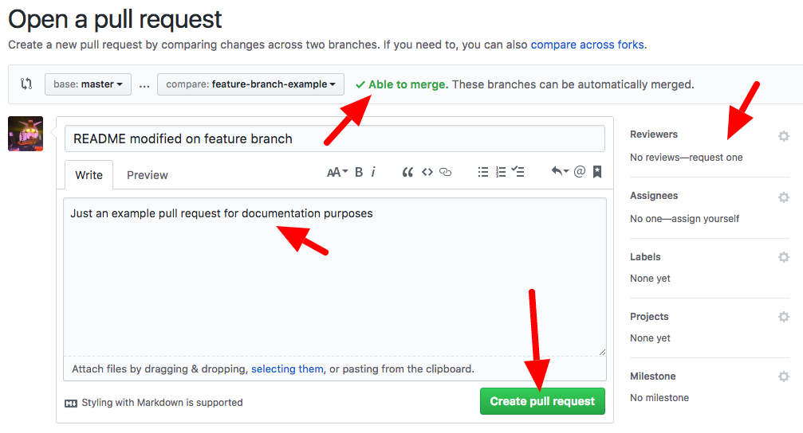
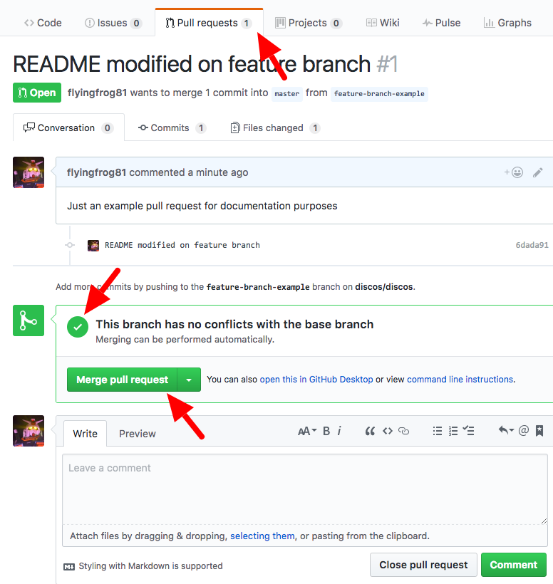
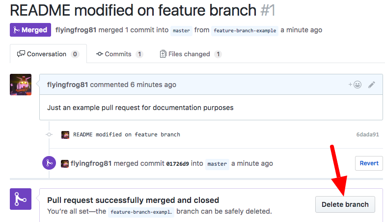

##################################
Contributing to DISCOS development
##################################

.. contents::

====================================
Making a change on the master branch
====================================

The **master** branch is our main development branch, we should do our best to keep
it stable and clean but we should never assume that master is a production-stable branch. 
Consider this as the old svn trunk.

Working on the master branch is simple, the only difference with svn is that now 
you work on a local copy of the project, and commits are done on your workstation 
rather than on the server. Once you feel confident of your changes you can push them
on the remote repository stored on github.com so that others can access your changes. 

----------------------------------------
Making a commit in your local repository
----------------------------------------

First we verify that our repository is up-to-date with the remote reposiroty, 
then we edit a file and note how git is aware of the new change.

.. code-block:: bash
  
  $ git status
  On branch master
  Your branch is up-to-date with 'origin/master'.
  nothing to commit, working tree clean
  $ git branch
  * master
  $ echo "DISCOS is in use at three italian radio telescopes" >> README.md
  $ git status
  On branch master
  Your branch is up-to-date with 'origin/master'.
  Changes not staged for commit:
    (use "git add <file>..." to update what will be committed)
    (use "git checkout -- <file>..." to discard changes in working directory)

      modified:   README.md

  no changes added to commit (use "git add" and/or "git commit -a")

The git status command shows and tracks all the changes made. There are cases this is not the best option.
If you want to track changes only on files already inder the control of the repository you should add an option.

.. code-block:: bash

	$git status -uno
	On branch master
	Your branch is up-to-date with 'origin/master'.
	nothing to commit (use -u to show untracked files)

Just as SVN, git offers a **diff** command that shows you what changes: 

.. code-block:: bash

   $ git diff
   diff --git a/README.md b/README.md
   index 041992e..f1d6f53 100644
   --- a/README.md
   +++ b/README.md
   @@ -1,3 +1,4 @@
    # DISCOS
     
     Discos is the Development of Italian Single-dish COntrol System
     +DISCOS is in use at three italian radio telescopes

We now add the changes to the next commit operation and create a new commit object
with an associated message: 

.. code-block:: bash 

   $ git add README.md
   $ git status
   On branch master
   Your branch is up-to-date with 'origin/master'.
   Changes to be committed:
     (use "git reset HEAD <file>..." to unstage)

        modified:   README.md

   $ git commit -m "updated README.md for the doc example" 
   [master 4ba4caa] updated README.md for the doc example
    1 file changed, 1 insertion(+)

We can see how git has just created a new *commit* on our local repository. The commit
is uniquely identified by the hashtag starting with *4ba4caa* and is on the branch 
*master*. The commit also has associated a messaged that we specified on the command line.
We could achieve the same result in one single step adding every changeset to the 
commit automatically using the *-a* option, without explicitly adding the files:

.. code-block:: bash
 
   $ git commit -am "updated README.md for the doc example" 

If we look now at the status and the commit tree of our local repo we can see:

.. code-block:: bash

   $ git status
   On branch master
   Your branch is ahead of 'origin/master' by 1 commit.
     (use "git push" to publish your local commits)
   nothing to commit, working tree clean
   $ gittree
   * 4ba4caa (HEAD -> master) updated README.md for the doc example
   * 04fc562 (origin/srt-0.1, origin/noto-0.1, origin/medicina-0.1, origin/master, origin/HEAD) added gitignore and readme

We can see how our newly created commit object is automatically labelled **HEAD** and is positioned one step forward with respect to the remote repository identified by **origin/HEAD** 

----------------------------------
Pushing into the remote repository
----------------------------------

If we want the remote repo to do this same step we need to *push* the commit object into the remote repository: 

.. code-block:: bash

   $ git push
   Counting objects: 3, done.
   Delta compression using up to 4 threads.
   Compressing objects: 100% (3/3), done.
   Writing objects: 100% (3/3), 385 bytes | 0 bytes/s, done.
   Total 3 (delta 1), reused 0 (delta 0)
   remote: Resolving deltas: 100% (1/1), completed with 1 local object.
   To github.com:discos/discos.git
      04fc562..4ba4caa  master -> master
   $ git status
   On branch master
   Your branch is up-to-date with 'origin/master'.
   nothing to commit, working tree clean
   $ gittree
   * 4ba4caa (HEAD -> master, origin/master, origin/HEAD) updated README.md for the doc example
   ... 

We can see how **HEAD** and **origin/HEAD** are now positioned on the same
commit object. If we look at the repository stored on github.com we would see this same
commit has appeared. 

============================================
Developing on a feature branch (RECOMMENDED)
============================================

Using a new branch for the development of a new feature is a common practice among git
users. This comes with some advantages: 

  * git branches are lightweight
  * git merge is really effective, no need to be scared
  * merging two branches can be realized using a **pull request** mechanism which 
    enables review of the proposed change 
  * Pull requests can be tested in isolation before being accepted

For any non trivial change **we strongly recommend** to `adopt this approach <https://confluence.atlassian.com/bitbucket/workflow-for-git-feature-branching-814201830.html>`_ .

---------------------
Creating a new branch
---------------------

A new branch can be created on your local copy of the repository using the **checkout** 
command with the **-b** option:

.. code-block:: bash

   $ git checkout -b feature-branch-example
   Switched to a new branch 'feature-branch-example'
   $ git branch -a
   * feature-branch-example
     master

We are automatically positioned on the new branch and we can start working on this.

------------------------------------------
Making changes and moving between branches
------------------------------------------

We will add another line to the README file and generate the commit on the newly created
branch:

.. code-block:: bash
  
    echo "A different product line is maintained for each radio telescope" >> README.md
    $ git commit -am "README modified on feature branch" 
    [feature-branch-example 6dada91] README modified on feature branch
     1 file changed, 1 insertion(+)
    $ gittree
    * 6dada91 (HEAD -> feature-branch-example) README modified on feature branch
    * 4ba4caa (origin/master, origin/HEAD, master) updated README.md for the doc example

We can see how our commit is positioned on the HEAD of the new branch, that is one step forward with respect to the master branch. 
In order to make our example a litlle more realistic and demonstrate a more concrete
pull request, we will add a commit on the master branch. This will also show how to move 
between branches: 

.. code-block:: bash

   $ git branch
   * feature-branch-example
     master
   $ git checkout master
   Switched to branch 'master'
   Your branch is up-to-date with 'origin/master'.
   $ git branch
   feature-branch-example
   * master
   $ vim .gitignore
   $ git commit -am "minor change in gitignore"
   [master 248e9c8] minor change in gitignore
    1 file changed, 1 insertion(+)
   $ gittree 
   * 248e9c8 (HEAD -> master) minor change in gitignore
   | * 6dada91 (feature-branch-example) README modified on feature branch
   |/  
   * 4ba4caa (origin/master, origin/HEAD) updated README.md for the doc example

We can see that the branch **master** has now diverted from **feature-branch-example**.
To better understand how git works we can now switch between branches and see how 
commits are applied to the files:

.. code-block:: bash

   $ git branch
   feature-branch-example
   * master
   $ less .gitignore
   *~
   .svn
   *swp
   ... 
   $ less README.md
   # DISCOS

   Discos is the Development of Italian Single-dish COntrol System
   DISCOS is in use at three italian radio telescopes
   
   $ git checkout feature-branch-example
   $ git branch
   * feature-branch-example
     master
   $ less .gitignore
   .svn
   *swp
   ... 
   $ less README.md
   # DISCOS

   Discos is the Development of Italian Single-dish COntrol System
   DISCOS is in use at three italian radio telescopes
   A different product line is maintained for each radio telescope

We can see how the commits are incorporated into the repository depending on the branch.

-------------------------
Generating a pull request
-------------------------

Now we want to generate a **pull request** so that the changes made in our feature
branch can be seen by everyone, reviewed, tested, and eventually merged into the master 
branch or declined.

We start by pushing the local branch into the remote repository:

.. code-block:: bash

   $ git push -u origin feature-branch-example
   Counting objects: 3, done.
   Delta compression using up to 4 threads.
   Compressing objects: 100% (3/3), done.
   Writing objects: 100% (3/3), 360 bytes | 0 bytes/s, done.
   Total 3 (delta 2), reused 0 (delta 0)
   remote: Resolving deltas: 100% (2/2), completed with 2 local objects.
   To github.com:discos/discos.git
    * [new branch]      feature-branch-example -> feature-branch-example
   Branch feature-branch-example set up to track remote branch feature-branch-example from origin.

The **push** command asks git to copy the local branch called *feature-branch-example* 
into the remote copy at *origin*, that in our case points to the github repo. The **-u**
option sets this remote branch as *upstream* for this local branch, this means that
further changes on this branch will be pushed to the remote branch just configured.
We now move to the github.com site and manage the pull request from there. 

We create the pull request from the new branch directly from the github homepage or 
navigating to the **branches** tab of the github repo.

We are now prompted with a page summarizing facts about our pull request.
At first, if we scroll down the page, we can see a summary of changes introduced by
this requet:

On the top of the page we can actually generate the request. You can see that git 
is already telling us that the request can be merged without conflicts, 
you can add comments, ask for a review of someone in particular, assign labels, milestones
etc.. finally we generate the pull request: 

------------------------
Accepting a pull request
------------------------

A new page is generated for this pull request. From this page, everybody can review
the proposed changes, make comments, and eventually accept the request for merging
it into the master branch: 

The request is merged, and we have the possibility to revert it or eventually to delete the feature branch from the remote repo. 
We will delete this as keeping it will only pollute our environment, now that
changes have been accepted into master. 

------------------------
Updating your local copy
------------------------

We can now opsition ourselves on our local master branch and update it 
to reflect changes in the remote repo: 

.. code-block:: bash

   $ git checkout master
   $ git pull
   remote: Counting objects: 1, done.
   remote: Total 1 (delta 0), reused 0 (delta 0), pack-reused 0
   Unpacking objects: 100% (1/1), done.
   From github.com:discos/discos
     4ba4caa..01726d9  master     -> origin/master
   Merge made by the 'recursive' strategy.
     README.md | 1 +
     1 file changed, 1 insertion(+)
   $ gittree      
   *   3f9086f (HEAD -> master) Merge branch 'master' of github.com:discos/discos
   |\  
   | *   01726d9 (origin/master, origin/HEAD) Merge pull request #1 from discos/feature-branch-example
   | |\  
   | | * 6dada91 (origin/feature-branch-example, feature-branch-example) README modified on feature branch
   | |/  
   * | 248e9c8 minor change in gitignore
   |/  
   * 4ba4caa updated README.md for the doc example
   * 04fc562 (origin/srt-0.1, origin/noto-0.1, origin/medicina-0.1) added gitignore and readme

A new commit is automatically created for merging our local changes with changes in the remote branch. 
We can now push our local changes to the remote branch. 

.. code-block:: bash

   $ git push
   Counting objects: 5, done.
   Delta compression using up to 4 threads.
   Compressing objects: 100% (5/5), done.
   Writing objects: 100% (5/5), 567 bytes | 0 bytes/s, done.
   Total 5 (delta 3), reused 0 (delta 0)
   remote: Resolving deltas: 100% (3/3), completed with 2 local objects.
   To github.com:discos/discos.git
      01726d9..3f9086f  master -> master

And see how everything is now aligned: 

.. code-block:: bash

   $ gittree
   *   3f9086f (HEAD -> master, origin/master, origin/HEAD) Merge branch 'master' of github.com:discos/discos
   |\  
   | *   01726d9 Merge pull request #1 from discos/feature-branch-example
   | |\  
   | | * 6dada91 (origin/feature-branch-example, feature-branch-example) README modified on feature branch
   | |/  
   * | 248e9c8 minor change in gitignore
   |/  
   * 4ba4caa updated README.md for the doc example

A number of commits have been created for the purpose of merging branches,
these could be avoided using different merge strategies.

