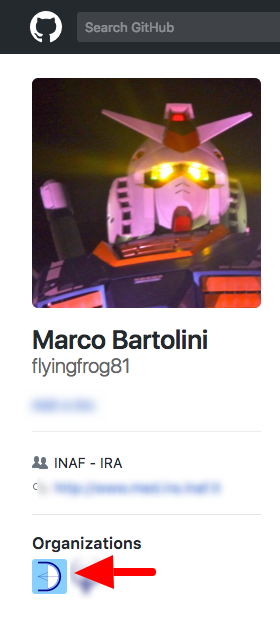
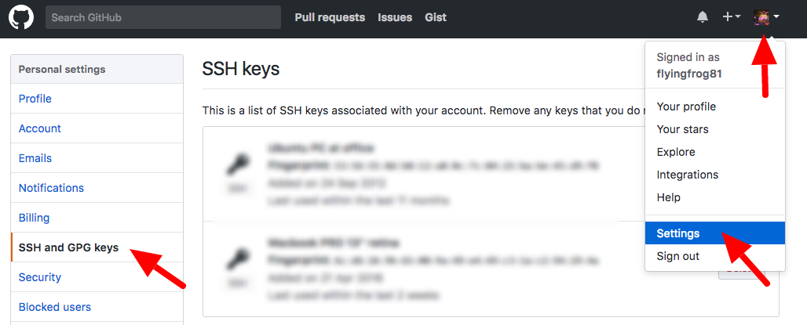
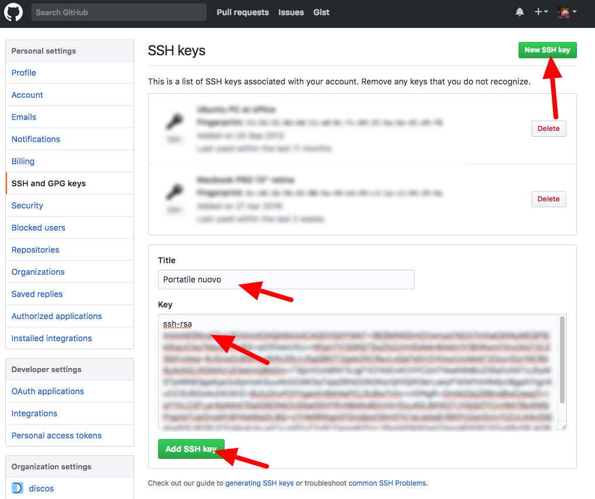

######################################
Configuring github user and repository
######################################

==========================
Access DISCOS organization
==========================

In order to configure your access to `github.com/discos/discos <https://github.com/discos/discos>`_ repository you need to be
part of the `DISCOS <https://github.com/discos>`_ organization. 
You can verify if you are part of the organization, 
visiting the settings page of your profile on github.com and verifying that 
DISCOS is listed in the organizations you belong to. As of 2017 it appears as an icon under your profile picture

================================
Adding an SSH key to github user
================================

You than need to make sure to have a proper SSH key associated with your github account. 
Navigate your profile settings to the **SSH and GPG keys** section

Then click on the **New SSH Key** button and insert details of your ssh key in the tab that opens up. 

===========================
Clone the discos repository
===========================

You can now clone the discos repository into a new *discos* folder:

.. code-block:: bash

   $ git clone git@github.com:discos/discos.git discos 
   Cloning into 'discos'...
   remote: Counting objects: 35171, done.
   remote: Compressing objects: 100% (7346/7346), done.
   remote: Total 35171 (delta 20599), reused 35007 (delta 20442), pack-reused 0
   Receiving objects: 100% (35171/35171), 24.43 MiB | 6.00 MiB/s, done.
   Resolving deltas: 100% (20599/20599), done.

This will create a new directory called *discos* which will automatically track the remote **master** branch. You can see all the branches hosted on the remote server using the **git branch -a** command.

.. code-block:: bash

   $ cd discos
   $ ls 
   Common               Noto            SRT             SystemMake
   Medicina     README.md       SystemBuild     UML-Project
   $ git branch -a
   * master
   remotes/origin/DerotatorAndMinorServo
   remotes/origin/HEAD -> origin/master
   remotes/origin/OffsetReview
   remotes/origin/latest64
   remotes/origin/master
   remotes/origin/medicina-0.1
   remotes/origin/noto-0.1
   remotes/origin/srt-0.1

==================
Adding Git aliases
==================

We will use an alias command **gittree** in the documentation. The command is defined as: 

.. code:: bash

   alias gittree='git log --oneline --graph --decorate --color --all'

Feel free to define it into you *.bashrc* *.bash_profile* ecc.. The command is used to 
display an ASCII tree of the repository in a pretty-printed format with colors and
essential informations about branches and tags.

.. code-block:: bash

   * 04fc562 (HEAD -> master, origin/srt-0.1, origin/noto-0.1, origin/medicina-0.1, origin/master, origin/HEAD) added gitignore and readme
   * 50233f3 backport of bugfix in calOn calOff commands from escs-0.5

   * 4768d39 fixed bug in buffer length too short for filenames
   * a7a69bb some tuning for the Roach2 backend integration in Medicina
   * 2327af6 added bash script to inject a command into the system: inject command
   * b8639ef small tuning for finalizer, reviewd configuration for CHC revc
   * e52308c Receievers CHC included in Medicina system
   ...

