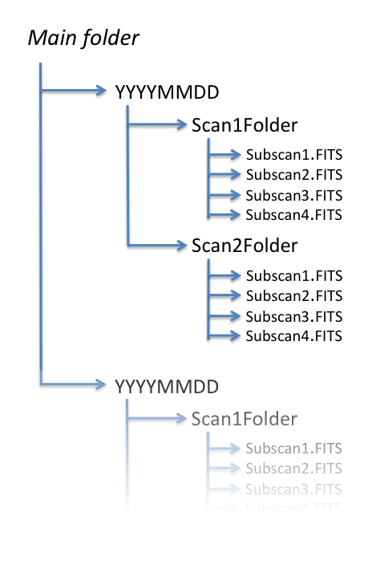

.. _E_Retrieving-the-data: 

*******************
Retrieving the data
*******************

Open a terminal on eccsConsole. Yoor data folder is::

    ~/data

Inside that folder, subfolders named according to the date (YYYYMMDD) will be 
automatically created during acquisitions. 
Taking into account the choice of the FITS format, the only one so far fully 
tested, the date-dependent folder contains a subfolder for every scan, inside 
which there are the FITS files (one for each subscan).

Scan folder names are composed as: 

**YYYMMDD-HHMMSS-Project-Suffix**

where 
	
    * **HHMMSS** is the UT time associated to the first sample of the 
      acquisition
    * **Project** is the code/name specified using the ``project=`` command, 
	  or when starting a schedule with 
	  ``startSchedule=[project/][schedulename].scd,[N]``
    * **Suffix** is a user-defined string retrieved from the schedule files. 
	  Though no control can be applied on the choice/check of this string, 
	  the agreement is that it should coincide with the target name. 

FITS files, each corresponding to a subscan, are composed as: 

**YYYYMMDD-HHMMSS-Project-Suffix_Scan#_Subscan#.fits**

Data can be copied from *escsConsole* to your laptop using  'ssh’  or   
‘rsync –e ssh’  commands.

.. note:: When recording manually-acquired data in FITS format, the output 
   files are stored in a peculiar path which is not accessible to users. 
   This implies that they also cannot be shown by the quick-look procedure. 
   This temporary situation, which requires the involvement of a system 
   administrator in order to retrieve the data, will be corrected as soon as 
   possible. 

You can retrieve your logfiles here::

    ~/logs

Its reply will let you know where the logfiles are located. A subfolder named 
*/WindLog* is devoted to the meteoClient output, if this client is used. 
 
