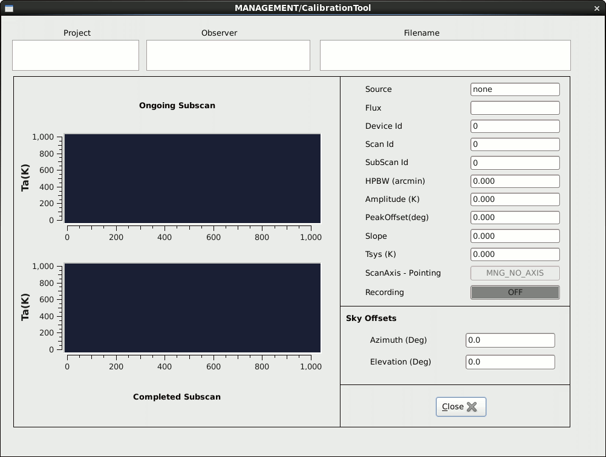

.. _E_Data-formats-and-online-quick-look:

**********************************
Data formats and online quick-look
**********************************

Details on the FITS file structure are given in a separate document. Download 
it here: :download:`pdf <attachments/MED-MAN-FITS-02.pdf>` 

Waiting for a comprehensive GUI which is going to include also a real-time 
preview of the data under acquisition, users are provided with two different 
tools in order to inspect the data produced by the TPB and XARCOS or SARDARA. 

If writer is MANAGEMENT/FitsZilla
=================================

The main quick-look tool is now web-based.
On the observing machine, go to a free desktop, so as you don't interfere with
the DISCOS system TUIs, and click on the "Quicklook" icon.
A web page will open. There, you will see a plot showing the raw content of 
last completed FITS file.  

.. admonition:: WARNING: 

   * **The web-based tool does not work with XARCOS acquisitions**

Please report any problem/request about this tool, which is under 
refinement.

If writer is MANAGEMENT/Point or MANAGEMENT/CalibrationTool
===========================================================

When data are acquired – both manually or through a schedule – using the Point 
or CalibrationTool writers, the quick-look must be performed using the 
CalibrationToolClient. 
Open a terminal on the observing machine and use the command:: 

    $ calibrationtoolclient  [componentName]

where componentName is either MANAGEMENT/Point or MANAGEMENT/CalibrationTool. 
A graphic window will appear. Its content is given in the following figure. 

.. note:: In this client, the subscan currently being acquired is shown 
   *in real-time* (upper plot), even if in a low-res version. Under this 
   display, the last completed subscan - in its full sampling - is shown. 
