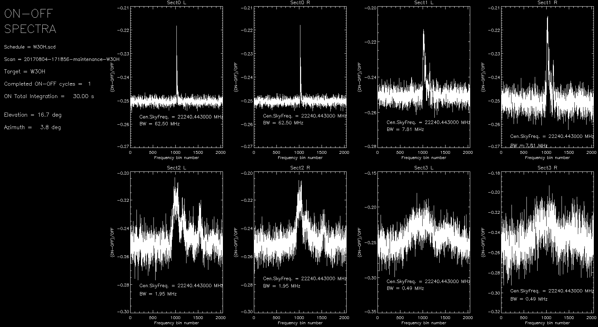

.. _E_Data-formats-and-online-quick-look:

**********************************
Data formats and online quick-look
**********************************

Details on the FITS file structure are given in a separate document. Download 
it here: :download:`pdf <attachments/MED-MAN-FITS-02.pdf>` 

Waiting for a comprehensive GUI which is going to include also a real-time 
preview of the data under acquisition, users are provided with two different 
tools in order to inspect the data produced by the TPB and XARCOS. 

If writer is MANAGEMENT/FitsZilla
=================================

The main quick-look tool is now web-based.
On the observing machine, go to a free desktop, so as you don't interfere with
the DISCOS system TUIs, and click on the "Quicklook" icon.
A web page will open. There, you will see a plot showing the raw content of 
last completed FITS file.  

.. admonition:: WARNING: 

   * **The web-based tool does not work with spectral acquisitions**

Due to a bug, only total power acquisitions can, at the moment, be viewed with 
this new tool. 

When acquiring FITS files through a schedule, there is also the old IDL tool available 
for the almost-realtime quick-look of the saved data.
 
Open a terminal on the projects machine (see instructions provided by user support). 
Launch IDL::

    $ idl

At the IDL prompt, compile and run the program fitslook.pro:: 

    IDL> .r fitslook
    IDL> fitslook

The last completed FITS file (i.e. the most recent subscan carried out, either 
being a TP or a spectral one) will be displayed. 

.. note:: The program automatically identifies the recorded sections and 
   plots them all. If you are using the multi-feed receiver with the aim of 
   actually exploiting only the central feed, adjust your schedule so that only
   sections 0 and 1 are enabled, otherwise all the sections will be recorded 
   and displayed. 

The plots show the proper file content, according to its continuum or spectral 
nature. Read all the program options using::

    IDL> fitslook, /help

.. note:: By default, fitslook displays raw data (in arbitrary counts). 
   Data streams in antenna temperature are available - and selectable - only 
   for the TPB and under the condition that a Tsys has been correctly acquired 
   prior to the execution of the scan. 

   
When performing ON-OFF spectral observations, users might also choose a 
different quick-look, displaying the (ON-OFF)/OFF result obtained by 
integrating all the subscans present in the last completed scan.
Users must specify the duty cycle, e.g. '3:3:1' if each scan is composed by 
3 on-scans, 3 off-scans and 1 cal-scan. Zero values are accepted. 
To invoke this program::

    IDL> .r onoff
    IDL> onoff, dutyc='[N_on]:[N_off]:[N_cal]' 

If wanting to display the spectra vs the topocentric radial velocity, use::

    IDL> onoff, dutyc='[N_on]:[N_off]:[N_cal]', xtype='vel'

 
    

    
Click on the above images to open the zoomable version. 

Please report any problem/request about these tools, which are constantly under 
development.

If writer is MANAGEMENT/Point or MANAGEMENT/CalibrationTool
===========================================================

When data are acquired – both manually or through a schedule – using the Point 
or CalibrationTool writers, the quick-look must be performed using the 
CalibrationToolClient. 
Open a terminal on the observing machine and use the command:: 

    $ calibrationtoolclient  [componentName]

where componentName is either MANAGEMENT/Point or MANAGEMENT/CalibrationTool. 
A graphic window will appear. Its content is given in the following figure. 

.. note:: In this client, the subscan currently being acquired is shown 
   *in real-time* (upper plot), even if in a low-res version. Under this 
   display, the last completed subscan - in its full sampling - is shown. 
