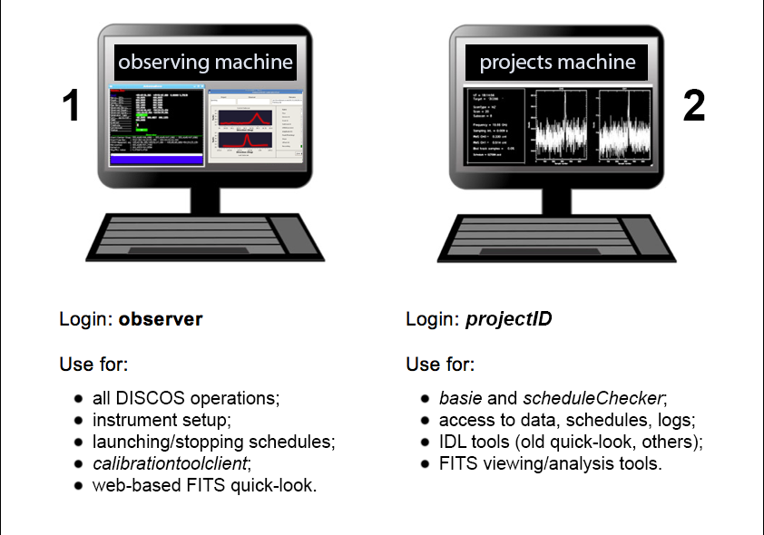

.. _ESCS-startup:

**************
DISCOS startup
**************

Logistics
=========

.. note:: **IP addresses and passwords are provided by the user support**. 
   Be sure to contact the user support before your session 
   starts, in order to get the latest information. 

Operations are always carried out through a VNC remote connection to the 
observing machine. Schedules and data can be accessed by reaching a different 
machine, which we can name "projects machine".

Observing machine: the system
-----------------------------
 
Open a VNC session and connect to the observing machine, following the
instructions provided by the user support. 

A remote desktop will then appear. In it, the DISCOS system should already be up 
and running, and you should see all the textual clients referring to the 
different containers/elements of the system. If you don't see them, first check the 
bottom bar, as they might have been reduced to icons. 
If indeed they are all missing and you need to start the clients, 
open a terminal and use::

	$ discosClients

This opens 9 panels at once: 

    * operatorInput - terminal for command line input
    * antennaBoss 
    * observatory 
    * mount 
    * genericBackend (x2)
    * receiversBoss
    * scheduler
    * logging

Rearrange the panels on the desktop. 

In case any of them does not automatically start, you can manually open them 
by means of individual command lines, to be given in a terminal shell::

	$ operatorInput 
	$ antennaBossTui 
	$ observatoryTui 
	$ mountTui 
	$ genericBackendTui BACKENDS/TotalPower
	$ genericBackendTui BACKENDS/XBackends
	$ receiversBossTui
	$ schedulerTui
	$ loggingDisplay

All the antenna/receiver/backend setup procedures are performed via the 
operatorInput window, which is also used to start/stop the schedules. 

The other panels are monitors used to display a vast amount of information, 
see :ref:`E_Appendix-A-Monitor-panels-full-description` and 
:ref:`E_Appendix-B-Complete-command-list` for a comprehensive description of 
their content and a list of all the commands available for the operatorInput 
(they can be inserted in schedules as well).

Projects machine: access to schedules, logs and data
----------------------------------------------------

A second machine is used for data retrieval (see dedicated 
sections), for the generation of schedules using basie and for tools 
such as DS9 or FV. 
Login credentials are specific to each project. 
While working on the observing machine, you can connect to the
projects machine via ssh using a terminal shell (you can take advantage 
of the different virtual desktops, in order not to crowd the 
system desktop)::    

	$ ssh –X [projectID]@[IP_address]

in your home you can find the following folders, whose names are 
self-explanatory::

    ~/data  
    ~/schedules
    ~/logs

.. note:: users can generate subfolders according to their needs to store 
   their schedules, but, in order to be executed, schedules must be placed 
   exactly in the ~/schedules folder. 

