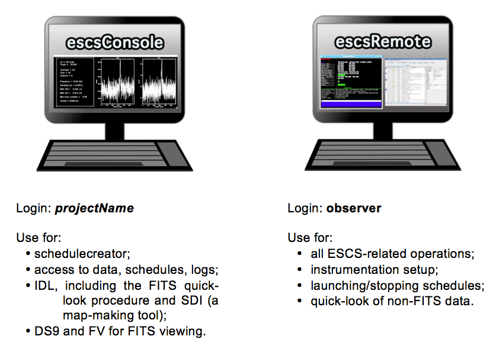

.. _ESCS-startup:

************
ESCS startup
************

Logistics
=========

.. note:: **passwords are provided locally**. As the control room logistics 
   might be updated, be sure to contact the local personnel before your session 
   starts, in order to get the latest information. 

Observations involve the use of two machines, located in the 32-m dish control 
room (the one storey building beside the antenna): 

 
On-site observations
====================

When the observers perform their acquisitions on-site, they exploit the 
escsConsole machine only - the one on the left. From there, a VNC connection 
(see details in the following sub-section) leads to escsRemote.   

escsRemote: input terminal and system monitors
----------------------------------------------

Login to escsConsole using your *projectcode*. 
Then, click on the VNC icon located on the Desktop. It will connect you to 
escsRemote as “observer”.
On escsRemote, you should find the input terminal and all the monitors already 
running. If, instead, you need to start them, open a terminal on escsRemote 
and give::

	> escsClients 

This opens 8 panels at once: 

    * operatorInput - terminal for command line input
    * antennaBoss 
    * observatory 
    * mount 
    * genericBackend 
    * receiversBoss
    * scheduler
    * logging

Rearrange the panels on the desktop. 

In case any of them does not automatically start, you can manually open them 
by means of individual command lines, to be given in the open terminal::

	> operatorInput 
	> antennaBossTui 
	> observatoryTui 
	> mountTui 
	> genericBackendTui BACKENDS/TotalPower  (or other backend code)
	> receiversBossTui
	> schedulerTui
	> loggingDisplay

All the antenna/receiver/backend setup procedures are performed via the 
operatorInput window, which is also used to start/stop the schedules. 

The other panels are monitors used to display a vast amount of information, 
see :ref:`E_Appendix-A-Monitor-panels-full-description` and 
:ref:`E_Appendix-B-Complete-command-list` for a comprehensive description of 
their content and a list of all the commands available for the operatorInput 
(they can be inserted in schedules as well).

escsConsole: access to schedules, logs and data
-----------------------------------------------

Directly use escsConsole for the data quicklook and retrieval (see dedicated 
sections), for the generation of schedules using schedulecreator and for tools 
as DS9 or FV.
Login credentials are specific to each project. Once logged in, in your home 
you can find the following folders, whose names are self-explanatory::

    ~/data  
    ~/schedules
    ~/logs

.. note:: users can generate subfolders according to their needs to store 
their schedules, but, in order to be executed, schedules must be places 
exactly in their ~/schedules folder. 

Remotely controlled observations
================================

It is possible to remotely perform the observations, exploiting a VNC 
connection to escsRemote. Open a VNC session and connect to::

	192.167.189.57:2  (i.e. port 5902) 

You will be asked to insert a password, which is the same used locally to 
login to escsRemote with the observer user. If you need to start the clients, 
open a terminal and command::

	> escsClients

and follow the same instructions provided for observations carried out on site. 

To access the other machine (escsConsole), where your data, schedules and 
logs are stored, simply open a terminal on your computer and use::

	> ssh –X projectName@192.167.189.54

Hence you can launch IDL, use schedulecreator, retrieve your data, etc… 

