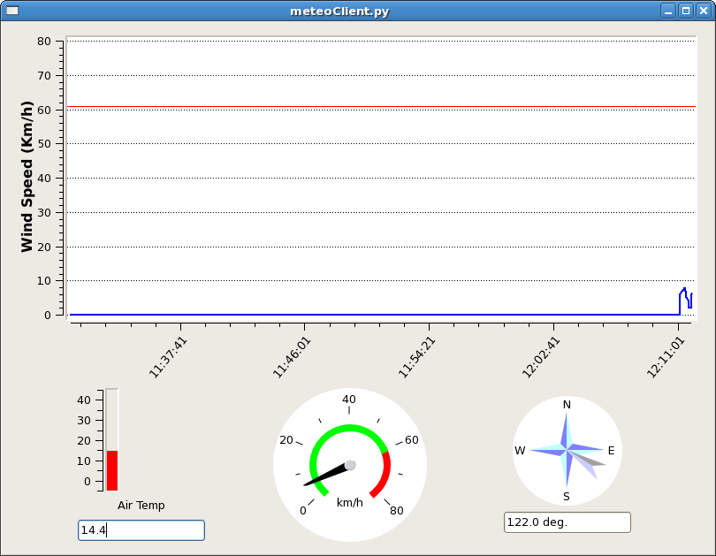

.. _EN_Command-line-measurements-and-acquisitions: 

******************************************
Command-line measurements and acquisitions
******************************************

Once the system and telescope setup had been completed, it is possible to 
manually perform measurements and observations **through the TPB**, which 
might as well pave the way – as preliminary checks – to longer lasting 
sessions carried out via schedules. 

Raw counts readouts
===================

The **raw counts readout** (called Tpi) of the signal can be obtained with::

	> getTpi

The system reply consists in an array of values (one for each section). 
As concerns the TPB, it is important to ascertain that the Tpi lies within the 
750-1000 counts range in order to keep your observations in the linear range of
the backend and allow for fairly bright sources to stay within as well. 
If this requirement is not met, it is necessary to iteratively vary the 
attenuation for the needed sections and check the Tpi, until the signal 
intensity falls into the proper range. 

As the signal level greatly varies with elevation, it is advisable to perform 
this operation in the elevation range that will be actually exploited during 
the observations or, as a general rule, at elevation=45°. 
Of course, the signal level is also greatly affected, especially at high 
frequencies, by weather conditions, therefore the attenuation tuning should be 
carried out again every time the conditions change. 

When you are going to manually get the Tpi - in order to ascertain which 
attenuation values to use in your schedule - *remember to set the LO frequency 
and the bandwidth as they will be employed in the schedule*. 
After a setup command, in fact, they are set to defaults; instead, if a 
schedule has been previously run, these values remain set as indicated in the 
last schedule readout.

.. note:: **Tpi values include the Tp0 level** (the internal, “without sky” 
   level, which is roughly 200 counts). Thus, when reading your output files, 
   which contain the (Tpi-Tp0) signal, you will see a baseline 200 counts 
   lower. 

Tsys
====

To measure the Tsys value::

	> tsys

the system replies with N values, where N is given by the total amount of 
(input_lines x sections). When using the TotalPower backend, N is the number 
of sections (2 for single-feed receivers and 14 for the MF).  

.. note:: The last measured Tsys value will be stored in the system and used, 
   *if the FITS format is selected for data storage*, to get a counts-to-Kelvin 
   conversion factor, in turn applied to all the following acquisitions, until 
   a new Tsys is measured. The FITS file will contain the raw data (in counts) 
   and also a table with the data stream calibrated (in K) using this 
   counts-to-Kelvin factor.

Weather parameters
==================

The **weather station** measurements can be retrieved with::

	> wx    

the reply will list ground temperature (\°C), relative humidity (\%), 
atmospheric pressure (hPa), wind speed (km/h). Updated values are available 
every 10 seconds. 

It is also possible to display the atmospheric temperature and the wind 
parameters (including wind direction) using a graphic interface.
Activate the meteo client by using the following command in a terminal on 
nuraghe-obs1::

	$ meteoClient

The following window will appear, it provides self-explanatory information. 

**Notice the top graph: the red line corresponds to wind speed = 61 km/h, at 
which the antenna must be stowed.** 

Considering that weather parameters are not necessarily written in the output 
files (in particular, wind speed and direction are not stored in the FITS 
files at present), it is possible to record a separate log containing these 
parameters plus information on the antenna pointing. 
Open a terminal on nuraghe-obs1 and execute the following command:: 

	$ windLogger

The script, besides displaying the information on screen, will produce a file 
which contains:

	* coordinates pointed by the antenna;
	* atmospheric temperature;
	* wind speed and direction.   

These logfiles are stored in a dedicated folder on OBS1: 

	/archive/logs/WindLog  (see also section “Retrieving the data”).

Filenames are assigned according to date and time of the script execution. For 
example, if the script is launched on November 26th 2013 at 13:46:31 UT, the 
resulting file will be: azel_131126_134631.log 
During the acquisition, the shell must not be closed. 
To interrupt the acquisition, use CTRL+C from the keyboard. 

Manual acquisitions
===================

When performing manually commanded acquisitions, it is necessary to 
**select the recording device**:: 

	> chooseRecorder=[string]

where string can be: 

	* **MANAGEMENT/Point** (default) text output in the logfile, used for 
	  pointing calibration	
	* **MANAGEMENT/CalibrationTool** text output in .dat file, used for 
	  pointing calibration  
	* **MANAGEMENT/FitsZilla** if FITS output is desired
	* (MANAGEMENT/MBFitsWriter) if MBFITS is preferred – not yet available

.. note:: When recording **manually-acquired** data in FITS format, the 
   **output files** are stored in a peculiar path which is not accessible to 
   users. This implies that they also cannot be shown by the quick-look 
   procedure. This temporary situation, which requires the involvement of a 
   system administrator in order to retrieve the data, will be corrected in 
   the next release of ESCS. 

Once the recorder is set, acquisitions on a target can be performed as follows. 
First, set the target:: 

	> track=[sourcename]	(if the source is included in the system 
	                        catalogue)

For the available catalogue see :ref:`EN_Appendix-D-Source-catalogue`.
To set a generic target::
	
	> sidereal=[sourcename],[RA],[Dec],[epoch],[sector] 
	
(see :ref:`EN_Antenna-operations` for details)
	                      
Here follow the commands to be used to manually record your data (remember
that the backend must have been properly set up and the target must have 
been specified as explained above)::

    > initRecording=[scn]
    
where [scn] in the scan number to be assigned to the acquisition.
The ``initRecording`` command prepares the data recording. Then::

    > startRecording=[sub_scn],[duration]
     
creates the output file and begins the data recording; [sub_scn] is the subscan
number, [duration] is the acquisition duration, expressed as ``hh:mm:ss``.
Once the acquisition is completed, the user can launch another subscan and 
record the data with another ``startRecording`` command. 
 
Finally, once the user wants to close the scan, the command to be used
is:: 

    > terminateScan

Output files will be found in the usual auxiliary folder where all the manual 
acquisitions are destined. 

Example: acquisition of a sidereal scan on 3c123 composed by 2 subscans, each 
lasting 40 s, preceded by an off-source Tsys measurement::

    > chooseRecorder=MANAGEMENT/FitsZilla
    > track=3c123
    > goOff=HOR,5
    > waitOnSource
    > tsys
    > azelOffsets=0.0d,0.0d 
    > initRecording=1
    > startRecording=1,00:00:40
    > startRecording=2,00:00:40
    > terminateScan
    
    

Pointing scans
-------------- 

Command cross-scans across a previously selected target (by means of the track 
or sidereal commands)::

	> crossScan=[subscanFrame],[span],[duration]

where subscanFrame is the coordinate frame along which the scan is performed 
(``eq``, ``hor`` or ``gal``), span is the spatial length on sky of the 
individual subscan (i.e. one line of the cross) expressed in degrees, duration i
s the time length espressed in hh:mm:ss, 

	e.g. ``> crossScan=HOR,1.0d,00:00:30``

corresponds to one cross-scan carried out in Horizontal coordinates (one line 
along El, one line along Az), each line being 1\° in span. Each subscan lasts 
30 seconds, thus the resulting scan speed is 2\°/min. 

When the MANAGEMENT/Point writer is used, the cross-scan produces text output 
in the logfile only (no output file is recorded). This output text contains 
information obtained by the automatic processing of the subscans. In 
particular, a Gaussian fit is performed in order to measure the source 
position and estimate the **pointing** offsets. If the fitting procedure 
in successful and the achieved offsets are considered plausible, pointing 
**corrections are immediately applied**. This means that, if no user-defined 
offset is commanded (or cleared) afterwards, the measured offsets remain 
active and are applied to the following observations. 

Here follows the function that is separately fitted to latitude and longitude 
subscans: 

y(x)=A\*e^W + ax +c

where:

	* W = -2.7725887 \* F^2  
	* F = (x-μ)/FWHM
	* μ = abscissa of peak

The results are given in the logfile, in the following sequence of lines:

|  **LATFIT**  latoff  fwhm A a c i 
|  **LONFIT**  lonoff  fwhm A a c i 
|  **OFFSET**  avlon  avlat  lonoff  latoff  lonflag  latflag
|  **XOFFSET**  avlon  avlat  lonoff\*cos(lat)  latoff  lonoff_err  *(cont.)*
|                latoff_err  lonflag  latflag 
|  **XGAIN**  target  avlon  avlat  lonampl  lonampl_err latampl  *(cont.)*
|              latampl_err  lonFWHM  lonFWHM_err  latFWHM  latFWHM_err  *(cont.)*  
|              flux  lonflag  latflag  

where (all angles in degrees):

|  *latoff* = latitude offset
|  *lonoff* = longitude offset
|  *i* = number of iterations performed by the fitting procedure
|  *avlon* = average longitude of peak (in same coordinate frame as the subscan execution)
|  *avlat* = average latitude of peak (in same coordinate frame as the subscan execution)
|  *lonflag* = fit result for longitude subscans 
|             (1 = plausible fit, 0 = non plausible fit, -1 = fit did not converge)
|  *latflag* = fit result for latitude subscans 
|             (1 = plausible fit, 0 = non plausible fit, -1 = fit did not converge)
|  *lonoff_err* = error on longitude offset
|  *latoff_err* = error on latitude offset
|  *target* = target name
|  *lonampl* = amplitude measured on longitude subscans (K)
|  *lonampl_err* = error on amplitude measured on longitude subscans (K)
|  *latampl* = amplitude measured on latitude subscans (K)
|  *latampl_err* = error on amplitude measured on latitude subscans (K)
|  *lonFWHM* = FWHM measured on longitude subscans
|  *lonFWHM_err* = error on FWHM measured on longitude subscans
|  *latFWHM* = FWHM measured on latitude subscans
|  *latFWHM_err* = error on FWHM measured on latitude subscans
|  *flux* = catalogue target flux (Jy), if available (otherwise it is put to 0.0). 

.

.. note:: it is possible to **include such pointing scans using the 
   MANAGEMENT/Point writer in schedules** as well. For example, an improved 
   pointing can be achieved setting the first scan on a source as a /Point 
   scan, then – in case the fit is successful – the following scans (e.g. 
   producing FITS or MBFITS files) will hold the offsets optimising the 
   pointing, given that no user-defined offset is updated by means of an 
   explicit ``radecOffsets``, ``azelOffsets`` or ``lonlatOffsets`` command.

Focus scans
----------- 

Command a focus scan on a previously selected target (by means of the track or 
sidereal commands)::

	> focusScan=[span],[duration]

where span is the length run on the z-axis expressed in mm, duration is the 
time length expressed in ``hh:mm:ss``

	e.g. ``> focusScan=60,00:01:00`` 
	
The ``focusScan`` command can be used inside schedules as well. See the 
separate guide to schedules for details. 	

Skydips
------- 

Skydip scans are indispensable in order to characterize the atmosphere. They 
consist in moving the telescope along a vast span in elevation 
(at fixed azimuth) while sampling with a backend. Their analysis allows the 
user to quantify the atmospheric opacity τ. 
There are different ways to perform this::

	> skydip=[El1],[El2],[duration]

e.g.  ``skydip=20d,80d,00:05:00`` performs a skydip between 80 and 20 degrees 
(at the current azimuth position), the scan will take 5 minutes (speed is thus 
12 °/min). The arguments must be in the range 10-88. 

The jolly character is supported for the elevation arguments. 
Example: ``skydip=*,*,00:04:00`` will perfom the skydip between the default 
values for elevation (15° and 90°). Please notice that pointing corrections 
are disabled.

Since no backend recording is automatically enabled by this command, remember 
to activate the FitsZilla recorder before launching the command, in order to 
save the data! 
This command can be used within schedules as well. See the separate guide to 
schedules for details. 

.. note:: At present skydips are always performed **downwards**, i.e. starting 
   from the highest elevation given in the command. **The greatest commandable 
   elevation is 88°**, since the skydip, being an OTF subscan, will be 
   additioned of an initial acceleration ramp – the length of which is 
   proportional to the scanning speed. 

Caveat on offsets
==================

As seen in :ref:`EN_Antenna-operations`, there are commands used to set 
(or null) user-defined offsets.  
They are: ``radeOffsets``, ``azelOffsets`` and ``lonlatOffsets``.
Such commands set **overall offsets** which **remain active** until they are 
explicitly changed/nulled by another call of one of the three commands.

Further offsets, having for example the purpose of pointing the antenna to an 
off-source position, are specified inside schedules, at the subscan level (see 
the separate guide to schedules). **The subscan-level offsets sum up to the 
overall offsets if they are expressed in the same coordinate frame**, and they 
are zeroed by default every time a new subscan is commanded.

   
