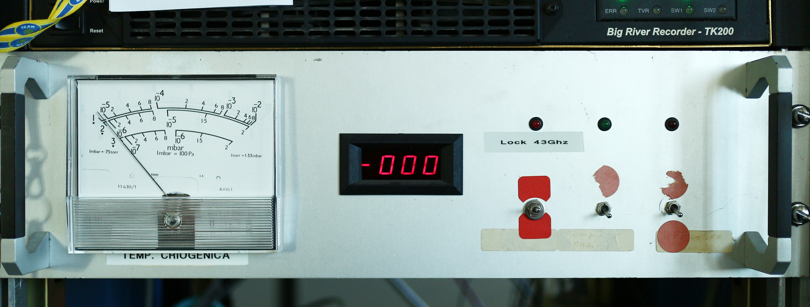

.. _EN_Frontend-operations:

*******************
Frontend operations
*******************

.. admonition:: WARNING:  

    * It is necessary to manually select the observing focus using the hardware 
      IF switch located in the control room. The figure below illustrates this
      rack.  

   selecting the observing focus. 
   :align: center

General rules
=============

To change the frontend Local Oscillator frequency, use the following command:: 

    > setLO=[freq1];[freq2];…;[freqN]

Notice the semicolon. Ideally, different values could be assigned to different 
IFs, thus tuning each section to a different sub-band. For the present 
hardware, though, this is not possible, so a single value must be specified: 

	e.g. ``> setLO=4900`` 

Remember that the actually observed band begins at a frequency which is 
usually different from the LO one (see Initial setup)

The temperature of the calibration mark in use is recorded in the logfile 
whenever a Tsys is measured. It is also stored in the FITS/MBFITS output files. 
The calibration mark can be manually switched on and off respectively with:: 

    > calOn 
    > calOff

If the user wants to perform the setup for the frontend only (without 
affecting the mount, the minor servo or the backend), the command is:: 

    > receiversSetup=[code]   (CCC, MMC, KKC, QQC)

 