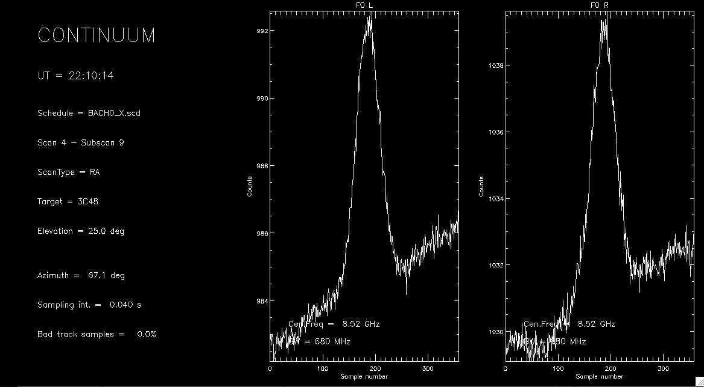
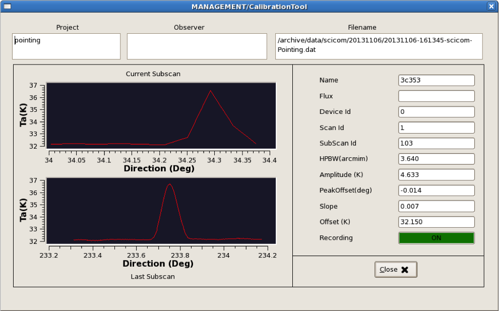

.. _EN_Data-formats-and-online-quick-look:

**********************************
Data formats and online quick-look
**********************************

Details on the FITS file structure are given in a separate document. Download 
it here: :download:`pdf <attachments/MED-MAN-FITS-02.pdf>` 

Waiting for a comprehensive GUI which is going to include also a real-time 
preview of the data under acquisition, users are provided with two different 
tools in order to inspect the data produced by the TPB. 

If writer is MANAGEMENT/FitsZilla
=================================
When acquiring FITS files through a schedule, there is an IDL tool available 
for the almost-realtime quick-look of the saved data.
 
Open a terminal on *euser*. Launch IDL::

    $ idl

At the IDL prompt, compile and run the program fitslook.pro:: 

    IDL> .r fitslook
    IDL> fitslook

The last completed FITS file (i.e. the most recent subscan carried out) will be 
displayed in terms of arbitrary counts vs sample number (i.e. raw intensity 
against time). 

.. note:: The program automatically identifies the recorded sections and 
   plots them all.

There are different options in order to plot the datai in terms of other 
quantities. Read all these options using::

    IDL> fitslook, /help

.. note:: Data streams in antenna temperature are available - and selectable - 
   only for the TPB and under the condition that a Tsys has been correctly 
   acquired prior to the execution of the scan. 

Please report any problem/request about this tool, as it is under development.

   
.. note:: If you are OK with the default settings, you can also launch the 
   quicklook using the icon provided on the euser desktop, without having to 
   start IDL, etc.   

If writer is MANAGEMENT/Point or MANAGEMENT/CalibrationTool
===========================================================

When data are acquired – both manually or through a schedule – using the Point 
or CalibrationTool writers, the quick-look must be performed using the 
CalibrationToolClient. 
Open a terminal on escs and use the command:: 

    $ calibrationtoolclient  [componentName]

where componentName is either MANAGEMENT/Point or MANAGEMENT/CalibrationTool. 
A graphic window will appear. Its content is given in the following figure. 

In this client, the subscan currently being acquired is shown *in real-time* 
(upper plot), even if in a low-res version. Under this display, the last 
completed subscan - in its full sampling - is shown. 

.. note:: You can also launch the calibrationtoolclient using the icon provided 
   on the euser desktop, without having to open a terminal, etc. 