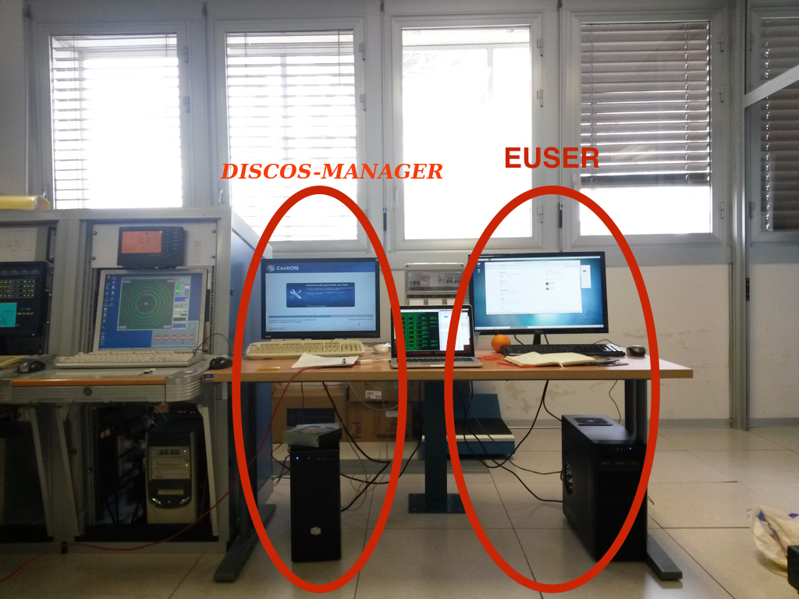

.. _ESCSN-startup:

**************
DISCOS startup
**************

Logistics
=========

.. note:: **passwords are provided locally**. Be sure to contact the local 
   personnel before your session starts, in order to get the latest information. 

Observations with DISCOS involve the use of one machine called discos-manager and located 
in the 32-m dish control room, the euser workstation is devoted to VLBI: 

discos: input terminal and system monitors
----------------------------------------------

Login to discos-manager using the provided credentials. 
You should find the input terminal and all the 
monitors already running. If, instead, you need to start them, use the bash command  "discosConsole".
This opens 8 panels at once: 

    * operatorInput - terminal for command line input
    * antennaBoss 
    * observatory 
    * mount 
    * genericBackend
    * receiversBoss
    * scheduler
    * logging

Rearrange the panels on the desktop. 

In case any of them does not automatically start, you can manually open them 
by means of individual command lines, to be given in a terminal::

	> operatorInput 
	> antennaBossTui 
	> observatoryTui 
	> mountTui 
	> genericBackendTui BACKENDS/TotalPower  
	> receiversBossTui
	> schedulerTui
	> loggingDisplay

All the antenna/receiver/backend setup procedures are performed via the 
operatorInput window, which is also used to start/stop the schedules. 

The other panels are monitors used to display a vast amount of information, 
see :ref:`EN_Appendix-A-Monitor-panels-full-description` and 
:ref:`EN_Appendix-B-Complete-command-list` for a comprehensive description of 
their content and a list of all the commands available for the operatorInput 
(they can be inserted in schedules as well).

your user or project account: access to schedules, logs and data
----------------------------------------------------------------

Directly use euser for the data quicklook and retrieval (see dedicated 
sections), for the generation of schedules using the "basie" tool and for tools 
as FV.
Once logged in, in your home you can find the following folders, whose names 
are self-explanatory::

    ~/data  
    ~/schedules
    ~/logs

.. note:: users can generate subfolders according to their needs to store 
   their schedules, but, in order to be executed, schedules must be places 
   *exactly* in their ~/schedules folder. 

(Remotely controlled observations): under development
=====================================================

It is possible to remotely perform the observations, exploiting a VNC 
connection to discos(instruction provided by local staff). Open a VNC session and connect to::

	192.167.187.XXX

You will be asked to insert a password (again, passwords are provided by the 
local staff). If you need to start the clients, open a terminal and command::

	> discosConsole

and follow the same instructions provided for observations carried out on site. 

To access your data, schedules and logs, simply open a terminal on your 
computer and use::

	> ssh –X [your-account]@192.167.187.xx 

Hence you can use basie, retrieve your data, etc… 

