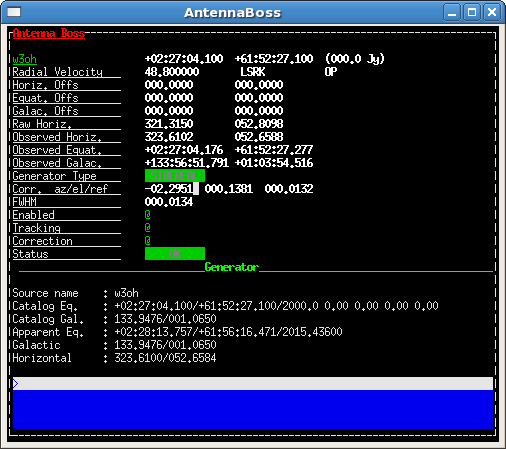
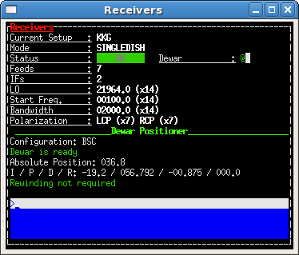

.. _Appendix-A-Monitor-panels-full-description:

********************************************
Appendix A - Monitor panels full description
********************************************

operatorInput
=============

This is the **input console** where users write Nuraghe commands. 
The prompt is just a sequential number enclosed in <>. 
If a command is properly read, the system replies repeating the command itself,
followed by the operation results (if they are foreseen). Otherwise, an error 
message appears. 
To close the window, type ``exit``. 

AntennaBoss
===========

This monitor shows the target info, indicating the commanded and actual 
positions pointed by the antenna. It also gives a feedback on the pointing 
accuracy and on the overall antenna status. 

Parameters: 

  * **Target**: label (as extracted from schedule or commanded), 
    coordinates (RAJ2000.0, DecJ2000.0), 
    estimated flux density (Jy, if available).
    
  * **Radial Velocity**:  (as extracted from schedule or commanded), 
    value (km/s unless it is a redshift), 
    velocity reference frame, velocity definition. 

  * **Horiz. Offs**: Horizontal (Az-El) offsets as 
    read from schedule, degrees.  

  * **Equat. Offs**: Equatorial (RA-Dec) offsets 
    as read from schedule, degrees. 

  * **Galac. Offs**: Galactic (l-b) offsets as read 
    from schedule, degrees. 

  * **Raw Horiz.**: commanded Az-El, 
    including pointing model, refraction, etc... 

  * **Observed Horiz.**: Az-El coordinates read from the mount 
    encoders and cleaned from the pointing model and refraction contributions. 
    Because of this, observed coordinates will differ from the raw ones. 

  * **Observed Equat.**: RA-Dec J2000.0 coordinates, converted from the 
    observed horizontal. 

  * **Observed Galac.**: l-b Galactic coordinates, converted from the 
    observed horizontal. 

  * **Generator Type**: which component is in charge of the generation of the 
    coordinates. 
    It can be ``NONE`` (which is the condition at startup), ``OTF``, ``MOON`` 
    or ``SIDEREAL``. 

  * **Corr. az/el/ref**: azimuth and elevation corrections (degrees) applied by
    the pointing model, plus the refraction model contribution– which is an
    additional correction to elevation. 

  * **FWHM**: Full Width Half Maximum (corresponding to HPBW), degrees. 

  * **Enabled**: a green ``@`` indicates that the antenna is correctly 
    receiving commands; a red ``o`` means the communication is disabled. 

  * **Tracking**: it indicates whether the pointing error exceeds 0.1*FWHM or 
    not. A green ``@`` corresponds to error < 0.1*FWMH. It should turn to a 
    red **o** only when the antenna is slewing between scans on the same 
    source, or when slewing to/from a new source. 

  * **Correction**: application of the above horizontal coordinates 
    corrections. If disabled (red circle), all corrections are zeroed. 

  * **Status**: ``OK``, ``WARNING`` or ``ERROR``. “Warning” needs investigation
    but usually does not stop the ongoing activity (it also appears at startup,
    before the setup commands), “Error” generally appears if something stops 
    the observations. 

  * **Generator**: under this line all the subscan setup parameters appear when
    it is commanded. See the two cases here below. 

In particular, for OTF observations: 

* **Start-Center-Stop** – coordinates in the subscan frame of the start, 
  center and stop positions (degrees)
  
* **StartTime-Dur.** – subscan start UT ``yyyy-doy-hh:mm:ss.s`` and duration 
  ``hh:mm:ss.s``
  
* **J2000-Apparent eq** – during the subscan, current RA-Dec position pointed 
  by the antenna, both in the J2000 epoch and precessed to the date. Format is  
  ``hh:mm:ss.s-°:’:”.”``
  
* **Horizontal** - during the subscan, current Az-El position pointed by the 
  antenna (degrees)

* **Galactic** - during the subscan, current l-b position pointed by the 
  antenna (degrees)

* **Sky/Phi rate** – actual subscan speed on sky along scanning direction (°/s)
  . The ‘Phi rate’ value refers to great circle arcs, if it is the scanning 
  geometry, otherwise it copies the first speed value. 

For **SIDEREAL** scans, instead, this is what appears:

* **Source name** – target name

* **Catalog Eq.** – target FK5 coordinates and info (if available): RA 
  ``hh:mm:ss.s``, Dec ``°:’:”.”``, Epoch, RA proper motion (milliarcsec 
  per julian year), Dec proper motion (milliarcsec per julian year), parallax 
  (milliarcsec), radial velocity (km/s)

* **Catalog Gal.** – target Galactic longitude and latitude (degrees) converted
  from the above Equatorial or provided by user/catalogue
	
* **Apparent Eq.** – target current apparent Equatorial coordinates: RA 
  ``hh:mm:ss.s``, Dec ``°:’:”.”``, Epoch   

* **Galactic** – current l-b position pointed by the antenna (degrees)

* **Horizontal** –current Az-El position pointed by the antenna (degrees)

	
To close the monitor, type ``exit`` in its prompt (the grey line). 

Observatory
===========

It is devoted to the station coordinates and times:

  * **Observatory Name**: SRT, Medicina or Noto
 
  * **Universal Time**: ``YYYY-DOY-HH:MM:SS.SSS`` 

  * **Julian Day**: ``d.ddd`` 

  * **Apparent GST**: Greenwich Sidereal Time ``HH:MM:SS.SSS`` 

  * **LST**: Local Sidereal Time ``HH:MM:SS.SSS``

  * **DUT1**: difference between UT1 and UT (s), if applied. 

  * **Pole motion**: celestial pole offset w.r.t. a reference position 
    (details are note provided here), measured in μarcsec on a tangential 
    projection. 

  * **Geodetic Coords**: updated Latitude and Longitude (degrees) and Altitude 
    (m) for the telescope, plus the geodetic model code. 

  * **Geocentric Coords**: geocentric cartesian coordinates (m) for the 
    telescope.

To close the monitor, type ``exit`` in its prompt (the grey line). 

Mount
=====

This is a quite complex frame, allowing the technical staff to monitor all the 
various parts of the antenna mount. 

Observers must focus only on a subset of the displayed parameters and flags. 
We thus describe the main features only. 

The top left section gives the online readouts for the Azimuth and Elevation 
axes, compared to the commanded positions. 
Line by line:

  * **Azimuth**: current azimuth position (in the -90°/450° wrapping range), 
    rate (°/s) and commanded offset (degrees). Then the measured position error
    and tracking error (both in degrees) are given. Finally, the axis active 
    mode is displayed: it can be ``PRESET`` (fixed Az-El pointing only), 
    ``PROGRAMTRACK`` (for tracking, OTF and schedules), STOP (if axes brakes 
    are on), ``UNKNOWN`` (indicating a non-configured status).

  * **Cmd Az.**: commanded azimuth position (in the -90°/450° wrapping range), 
    rate (°/s) and offset (°). This offset comes from metrology devices, it is 
    not related to user-defined offsets or subscan-defined offsets. 

  * **Elevation**: current elevation position (degrees), rate (°/s) and 
    commanded offset (degrees). Then the measured position error and tracking 
    error (both in degrees) are given. Finally, the axis active mode is 
    displayed: it can be ``PRESET`` (fixed Az-El pointing), ``PROGRAMTRACK`` 
    (for OTF and schedules), ``STOP`` (if axes brakes are on), ``UNKNOWN`` 
    (usually indicating an error condition).

  * **Cmd El.**: commanded elevation position (degrees) and rate (°/s). 

  * **Wrap**: readouts from the cable wrap. The status flag on the right can 
    be ``CW``or ``CCW``. 

The general condition of the mount is summed up by one keyword, in the central 
part:

  * **Mount status**: it can be ``OK``, ``WARNING``, ``FAILURE`` or ``BUSY``, 
    the latter is associated to operations which take a lot of time to complete
    (as the stow-unstow procedure). When the mount is BUSY it will not accept 
    further commands until the ongoing operation is completed.  

The rest of the panel lists several **flags and status labels**. 
For average users, the only points to be taken into account are:

    * in standard observing conditions, when a schedule runs, all flags should 
      be green ``o``;
    * in case of warnings, flags turn to yellow ``o``;
    * errors correspond to red ``o``;
    * when a “failure” keyword turns steadily to a red ``o``, or a permanent 
      failure status appears, immediately call for technical assistance. 

To close the monitor, type ``exit`` in its prompt (the grey line). 

GenericBackend
==============

The panel shows one row for every section. 

  * **Freq**: value (MHz) to be added to the LO frequency in order to obtain 
    the observed frequency at the beginning of the band

  * **BW**: bandwidth (MHz) 

  * **Feed**: number of the receiver feed connected to this section

  * **S.R.**: sampling rate (MHz) 

  * **Pol**: polarisation (Left or Right) 

  * **Bins**: number of frequency bins (1 for total power) 

  * **DBs**: attenuation (dB) applied to the section 

  * **Sect**: section number 

  * **Tsys**: the last measured Tsys (K)

Also some backend-dependent status flags are present, in the top right area. 
When observing with the TPB, look for:

  * **Time_Sync**: if it frequently or steadily turns red call for 
    assistance (the backend time is not synchronized)

  * **Busy**: when schedules are running, it must turn yellow. 
    If it does not, the backend is not acquiring.

To close the monitor, type ``exit`` in its prompt (the grey line). 

ReceiversBoss
=============

This monitor summarizes the frontend setup. The bottom part is devoted to the
derotator (dewar positioner), when available. 

  * **Current setup**: receiver code

  * **Mode**: ``NORMAL``, ``SINGLEDISH``, ``VLBI``… (other codes to come) 

  * **Status**: ``OK``, ``WARNING`` or ``FAILURE``

  * **Feeds**: number of feeds (1 fore single-feed receivers, 7 for the K-band 
    MF)

  * **LO**: Local Oscillator frequency (MHz)
  
  * **Start Freq.**: step (MHz) to be added to the LO frequency in order to 
    obtain the actually observed frequency at the beginning of the band

  * **Bandwidth**: actually observed bandwidth (MHz)

  * **Polarization**: ``LCP``, ``RCP``, ``HLP`` or ``VLP``
  
  * **Dewar positioner**: under this line all the derotator details are given.

In particular: 

  * **Configuration**: shows the current configuration (FIXED, BSC, CUSTOM)

  * **Dewar is ready**: is a green-colored string appearing when the dewar 
    positioner is ok. It changes to a red "Dewar in not ready" otherwise.

  * **Absolute Position**: shows the present position (encoder readout) wrt 
    the mechanic zero (degrees). A positive angle means CW. 

  * **I / P / D / R**: notable angles involved in the current derotator usage:
   
    I = Initial offset angle set for the current configuration (degrees); for 
    FIXED or CUSTOM configuration it is the user-set angle, for BSC is a 
    receiver-dependent angle, -19.2° for the K-band MF) 
  
    P = Parallactic angle of the pointed position (degrees)
    
    D = variation (Delta) of the parallactic angle since the beginning of the
    acquisition (degrees)
    
    R = reports the angle (degrees) applied if a derotator rewind has occurred.
       
  * **Rewinding not required**: is a green-colored string appearing when the 
    dewar rewind is not necessary. It changes to a red "Rewinding is required" 
    when the derotator reaches its range limits and to a yellow "Rewinding
    required (rewinding...)" while the rewind is taking place. When red or
    yellow, it implies that the general tracking flag in the Antenna TUI will 
    turn red and the antenna status will be labeled as "off-source" (this 
    involving the tracking flag associated to any data sample which might 
    still be under acquisition).
    The rewinding operations will not stop an ongoing subscan/acquisition, but 
    no further acquisitions will be commanded until the antenna is back 
    on-source.  

To close the monitor, type ``exit`` in its prompt (the grey line). 

Scheduler
=========

This monitor shows details on the selected data acquisition devices and on the 
running schedule, if any.

  * **Project code**: project name, as specified at the launch of 
    the schedule (or as input using the *project=* command)

  * **Schedule**: name of the active schedule

  * **Scan/Subscan**: scan number and subscan number, relative to the ongoing 
    acquisition

  * **Backend**: name of the selected backend, as listed in the schedule

  * **Recorder**: name of the selected data recording device, as listed in the 
    schedule

  * **Device**: number of the currently selected device (see device= command)
  
  * **Rest Freq.**: rest frequency of the line(s) being observed (MHz). The 
    number in brackets indicates how many IFs the given rest frequency 
    refers to.

  * **Tracking**: tracking status of the telescope, including antenna, 
    active surface, minor servo. A red ``o`` means the telescope is not 
    yet in its tracking route (or that it is not tracking properly), 
    a green light means the observation is ongoing and the tracking is 
    accurate within 0.1*HPBW

  * **Status**: flag summarising the telescope status. ``OK`` is 
    self-explanatory, ``WARNING`` in principle indicates that the acquisition 
    can go on even if a problem has been reported, ``ERROR`` signals that a 
    major problem was detected and the observation cannot be performed.  

To close the monitor, type ``exit`` in its prompt (the grey line). 

MinorServo
==========

This monitor shows details on the Minor Servo systems:

  * **Current Setup**: current setup code (**CCB**, **KKG**, **KKG_ASACTIVE**,
    …)

  * **Ready**: when green, the receiver is in its working position

  * **Starting** : when green, the minor servo are moving in order to put 
    the selected receiver in its working position

  * **AS Conf**: when green, the subreflector position is computed by assuming 
    the primary mirror surface is shaped and active (it is changing 
    with the antenna elavation)

  * **Elevation Track**: when green, the subreflector is changing its 
    position with the elevation

  * **Scan active**: when green, a scan is active. That means either the system 
    is performing a scan or a scan is terminated and so the system is waiting 
    for a stopScan command or for a new scan 

  * **Scanning**: when green, the system is performing a scan

To close the monitor, type ``exit`` in its prompt (the grey line). 

.. note:: All the monitors can be closed at a time using the command (in a 
   terminal on OBS1)::

	$ nuragheConsole --stop
	
	
Logging Display
===============

This panel is not part of the general Console, so it must be individually
opened/closed. 
Here all the log messages will appear. New messages are shown on top of the 
previous ones. 
To close the window, 

 

