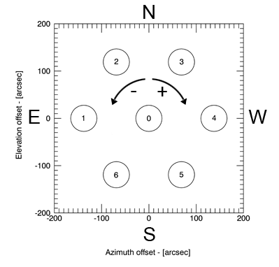

.. _Use-of-the-MF-derotator: 

***********************
Use of the MF derotator
***********************

The K-band 7-feed receiver is provided with a rotating dewar, in order to 
prevent field rotation during long acquisitions (while performing OTF/raster 
mapping or simple sidereal tracking).
When the receiver is commanded a setup, this derotator is automatically set up 
in the default FIXED configuration - i.e. it will be placed in its rest 
position and it will not update its position along time.  

Rest position
=============

When the dewar angle is set to 0°, the MF receiver is positioned as 
displayed in the following figure. Feeds 3-0-6 are aligned along a line that
is parallel to the horizon, with feed number 3 being on the East side of the 
central feed. 

 

The static x-y offsets corresponding to this rest position, also 
provided in the output FITS files (see dedicated documentation), are:

.. tabularcolumns:: |c|r|r|

==== ================= =================  
Feed x-offset (arcsec) y-offset (arcsec)
==== ================= =================
1         68.800           -119.165
2        -68.800           -119.165
3       -137.600              0.000
4        -68.800            119.165
5         68.800            119.165
6        137.600              0.000
==== ================= =================  

In order to be transformed in Az-El offsets, a cos(El) factor must be taken 
into account for the Azimuth (x) offsets.  

Convention on angles
--------------------

The dewar rotation is considered positive when moving clockwise. 

Configurations
==============

To select the derotator configuration, use the following command in the 
operatorInput panel:: 

    > derotatorSetConfiguration=[conf] 

where [conf] can have one of the following values: ``FIXED``, ``BSC``,
``CUSTOM``.
Here follows a brief description of these different options. 
 

FIXED
-----

The dewar keeps a fixed position wrt the horizon, i.e. no derotation is 
applied.
It is possible to command a specific static angle::

    > derotatorSetPosition=[ang]d

e.g. ``> derotatorSetPosition=10.0d`` rotates the dewar 10° clockwise 

To read back the dewar position, use::

    > derotatorGetPosition

BSC
---
The *Best Space Coverage* configuration is useful for scans. 
It automatically rotates the dewar in order to best cover the scanned area, 
according to system-defined parameters which are specific to the receiver in 
use and taking into account the reference frame of the observation (Equatorial, 
Galactic and Horizontal). 

If scans (OTF or raster) are being held in a celestial frame (i.e. EQ or GAL), 
this means that the dewar will be positioned so that the feed tracks on the 
sky are monospaced along the axis which is orthogonal to the scanning axis, and
this geometry will be kept along the whole acquisition - i.e. the derotation is
active. 

For the Horizontal frame (scans taking place along Azimuth or Elevation) the 
derotation is not enabled: the dewar is in a fixed position, where the specific
angle is chosen by the system in order to obtain the equally-spaced scans. 

As in BSC mode the needed angles are pre-defined, any use of the 
``derotatorSetPosition`` command will raise an error. 

CUSTOM
------

In this configuration it is the user to choose which angle the dewar axis must
form with the y-axis of the scanning frame. 
Once this angle is set by means of the ``derotatorSetPosition`` command, and
the scans are commanded, this angle is kept for the whole duration of the 
acquisition - i.e. the derotation is active. 
As above, when acquisitions are performed in the Horizontal frame, the 
derotation is inhibited and the initial angle is kept fixed wrt the horizon. 

Rewinding
=========
The dewar can rotate within a limited range due to physical constraints.
For the K-band 7-feed receiver this range, wrt the rest position, goes from
-85.77° to +125.23°.  
This means that it is necessary to periodically rewind it in order to achieve
the desired feed positions. It can happen both when a new scan is commanded and 
during long acquisitions, when the parallactic angle variation overcomes the 
available rotation range. 

The system is in charge of automatically commanding a dewar rewind whenever it 
is required. This means that pauses might take place between consecutive 
subscans, and that a certain sky position will be observed by two
different feeds before and after the rewind: a rewind implies the
rotation by N*60° (where N can be 1, 2 or 3). The system will always choose the
maximum allowed rewind, in order to delay the following rewind as much as 
possible. 

