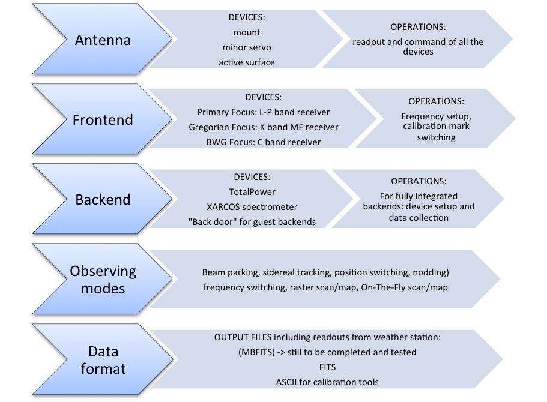

.. _Overview: 

********
Overview 
********

What Nuraghe is
===============

Nuraghe is the control software produced for the Sardinia Radio Telescope. 
It is a distributed system based on ACS (ALMA Common Software), commanding all
the devices of the telescope and allowing the user to perform single-dish
observations in the most common modes. 
As of today, the code specifically implemented for the telescopes (i.e. 
excluding the huge ACS framework) amounts to about 612500 lines (512600 if not
considering comments). 
Even VLBI (or guest-backend) observations partly rely on Nuraghe, as it must be
used to perform the focus selection and the frontend setup. 

This guide is meant to help the observer in the use of Nuraghe, without dealing
with the “behind-the-curtains” complex details of the system. 
This release focuses on **single-dish continuum and spectroscopy
observations**; the fully integrated backends available on-site are the
analog total power one and the XARCOS spectrometer. A Roach-based back-end is
also available, but it is not yet completely integrated in Nuraghe.
Since both the hardware and software implementations are still going on at SRT, 
this manual will forcibly undergo continuous revisions. 
 
Here follows a simple schematization of the observing system, helpful to
visualize all the main devices Nuraghe deals with and the most important
operations it performs. 

.. note:: (1) This backend is only partially integrated. This mainly means 
   that its setup can be performed in Nuraghe but the output files are produced 
   externally to it
   (2) Frequency switching is possible only manually editing the schedules, as
   the schedule-creating tool does not foresee this specific mode, yet. 
   (3) MBFITS files are planned to be available in the future.  

Glossary: terms and abbreviations
=================================

:>: this symbol precedes commands to be given in the operatorInput panel
:$: this symbol precedes commands to be given in a system shell
:AS: active surface
:Beam-parking: the antenna points to a fixed Azimuth-Elevation position 
:Bin: frequency channel
:FWHM: Full-Width Half-Maximum
:HPBW: Half-Power BeamWidth
:MF: Multi-Feed
:MS: Minor Servo system, which includes the subreflector and the PFP
:Nodding (aka “beam switching”): it involves two or more feeds. The source is 
 alternatively observed with each of the feeds, so that there is always one 
 feed “on source”
:OTF: On-The-Fly acquisition. The antenna moves according to user-defined
 parameters, scanning the sky at constant speed. Data acquisition is active
 during the scan
:PFP: Primary Focus Positioner, the servo which allows to put the primary focus
 receivers in place 
:Position switching (aka “on-off”): the beam is alternatively pointed to the
 source (on) and to a properly defined offset position (off)
:Preset: mount mode allowing only beam-parking observations, with no pointing
 model applied
:ProgramTrack: mount mode allowing tracking, OTF/raster scans, beam-parking 
:Raster: acquisition is performed via discrete pointings (in tracking or
 beam-parking mode), planned to sample a certain path/area on the sky 
:Section: acquisition stream (aka “logical channel”). E.g.: the 7-feeds of the
 K-band receiver used with the continuum backend produce 7 feeds x 2
 polarisations = 14 sections  
:SF: Single-Feed
:Slewing: motion of the antenna when it is going to the target position.
 Slewing is always performed at maximum speed, with no data acquisition taking
 place
:Temporised commands: user-input or schedule commands that are launched to a
 specific UT time by means of the “@” symbol
:Time-tagged commands: when commands are not temporised, the philosophy for
 their execution is asap (as soon as possible), but the system internally
 schedules them associating each operation to a properly computed time. This is
 particularly relevant for the positions commanded to the mount, so that the
 antenna motions take place along a fully controlled path (except in slewing)
:TPB: Total Power Backend
:Tracking: the antenna points to a target and, if it is a celestial target,
 follows its sidereal motion

