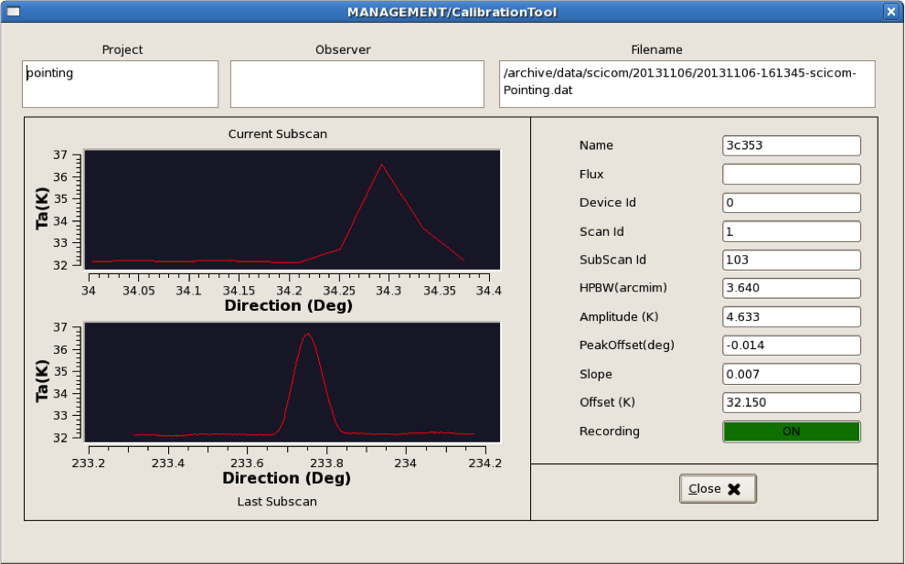

.. _Data-formats-and-online-quick-look:

**********************************
Data formats and online quick-look
**********************************

DISCOS FITS output files
========================

Details on the FITS file structure are given in a separate document. Download 
it here: :download:`pdf <attachments/SRT-MAN-10000-003-4.pdf>` 

Online data quick-look (FITS acquisitions)
==========================================

During acquisitions, you can inspect the recorded data in real time, 
by using a dedicated web tool. 
Launch it by double-clicking on the quicklook.html icon located on the
*discos-console* desktop. 

If writer is MANAGEMENT/Point or MANAGEMENT/CalibrationTool
===========================================================

When data are acquired – both manually or through a schedule – using the Point 
or CalibrationTool writers, the quick-look can be performed using the 
CalibrationToolClient. 
Open a terminal on *discos-console* and use the command:: 

    $ calibrationtoolclient  [componentName]

where componentName is either MANAGEMENT/Point or MANAGEMENT/CalibrationTool. 
A graphic window will appear. Its content is given in the following figure. 

.. note:: In this client, the subscan currently being acquired is shown 
   *in real-time* (upper plot), even if in a low-res version. Under this 
   display, the last completed subscan - in its full sampling - is shown. 
