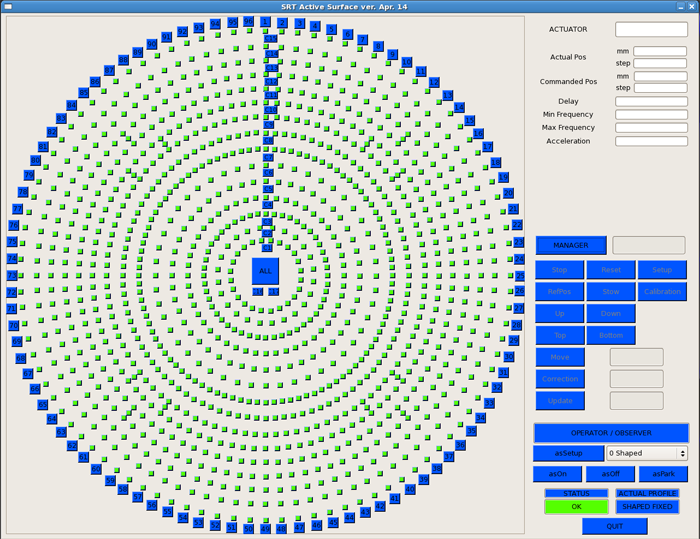

.. _Initial-setup:

*************
Initial setup
*************

.. _overall_setup:

Antenna overall setup
=====================

When opening a DISCOS observing session, it is necessary to perform a setup 
which includes the antenna unstow, the mount configuration in tracking mode, 
the minor servo setup. This is done by means of a unique command, which is 
specific for the wanted receiver, to be written in the **operatorInput**. 
The currently available choices are::

    > setupLLP  for the L band receiver (Primary focus)
    > setupPPP  for the P band receiver (Primary focus)
    > setupCCB  for the C band receiver (BWG focus)
    > setupKKG  for the K band receiver (Gregorian focus)

.. note:: Spaces within the command line content are **not** allowed!

The above setup command sets the antenna mount, the minor servos, the selected 
receiver and the default backend (TotalPower) according to **default 
parameters**. The antenna mode is set to **ProgramTrack** (allowing tracking 
and the execution of schedules), while the Local Oscillator frequency and the 
bandwidth are set as illustrated in the following table.

.. tabularcolumns:: |c|c|c|c|c|

========  ==========  ==========  ==============  ==========  =================
Receiver  LO freq     Frontend    Backend         Observed    Observed
                      IF band     IF band         bandwidth   band
--------  ----------  ----------  --------------  ----------  -----------------
code      \(MHz\)     \(MHz\)     \(MHz\)         \(MHz\)     \(MHz\)
========  ==========  ==========  ==============  ==========  ================= 
LLP       \(0\)       1300-1800   (50-2350) [1]_   500        (1300-1800) [1]_
PPP       \(0\)       305-390     (50-730) [1]_    85         (305-390) [1]_
CCB       5600        100-2100    50-2350          2000       5700-7700 
KKG       21964       100-2100    50-2350          2000       22064-24064
========  ==========  ==========  ==============  ==========  =================

.. [1] Still subject to variations

Notice that, depending on the devices in use, the sky frequency at the 
observed band starting point is given by the LO frequency plus an offset. For 
the present combinations of the frontends *with the total power backend*, 
which the above table refers to, this offset is 100 MHz. 
In general, the true observed band depends on the **intersection between the 
frontend IF band and the chosen backend filter**. The actual observed 
bandwidth and the band starting frequency are recorded in the output files 
(see :ref:`Appendix-C-Output-files`).

Active Surface setup
====================

After the initial setup, to configure and enable the active surface (AS) give 
the following commands in the operatorInput panel::

    > asSetup=[code]   

where \[code\] is:

    * **SF** shaped configuration in fixed position (optimised for El=45°)
    * **S**  shaped configuration in tracking – i.e. it adjusts according to 
      the observed  elevation position
    * **PF** parabolic configuration in fixed position (optimised for El=45°)
    * **P**  parabolic configuration in tracking – i.e. it adjusts according to 
      the observed elevation position
      
.. warning:: Check the AS status! 
   In case the system - or just the AS - was rebooted, pay attention to 
   give the ``asSetup`` command only once all the AS actuators are online and 
   ready. You can check this condition in the GUI shown below. Red pixels in 
   the graphical representation of the AS indicate off-line actuators, while 
   green pixels identify the on-line actuators. 
   

Minor Servo configuration
=========================
When using the Gregorian or BWG focus only, the :ref:`overall_setup`
automatically configures the minor servo system in order for the
elevation to be tracked, and assumes the active surface is enabled.
That means the minor servo setup automatically issues the following
commands:

.. code-block:: discos

    > setServoElevationTracking=ON
    > setServoASConfiguration=ON

The user is asked to issue the correct configuration in case other
behaviours are required.

Logfile and project code
========================

The default logfile is named **station.log**. 
If the user wants to change it::

    > log=[logfilename]  (without extension)

Logfiles are stored in a dedicated folder (see :ref:`Retrieving-the-data`).
**When schedules are run, a new logfile is automatically started**, and it is 
named after the schedule: [schedulename].log.

It is possible, and advisable, to insert the project code/name (a string 
assigned to the project by the TAC) using the command::

    > project=[projectcode]   (e.g. project=scicom)      

This will make the user save time in later stages, as it will not be necessary 
to specify the project name in schedule-launching commands. The project 
code/name must correspond to an existing user, already known to the system. 
This means that, if its spelling does not match with the recorded name, an 
error rises.
 
