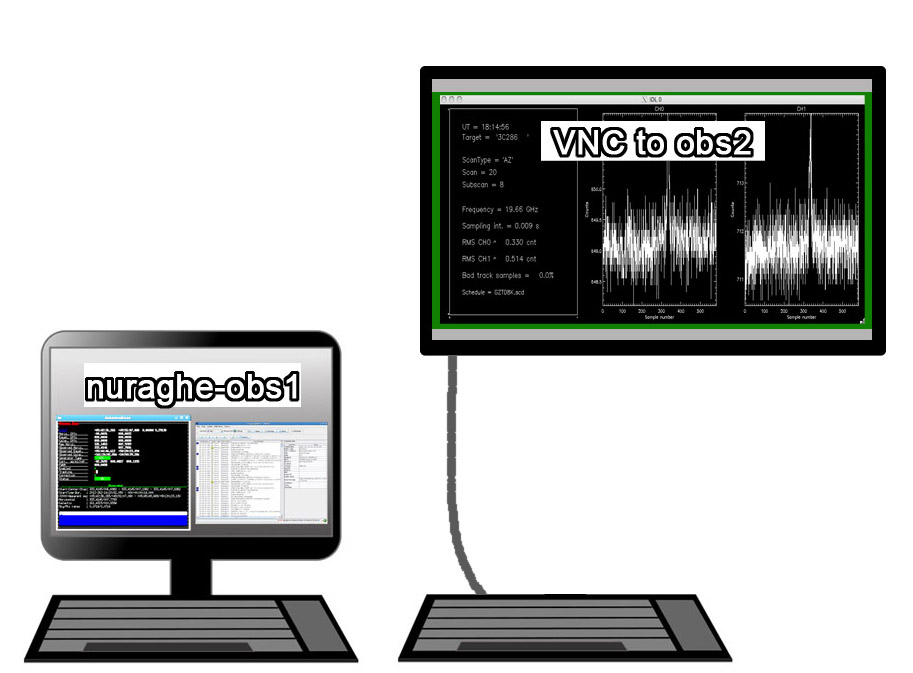

.. _Nuraghe-startup:

***************
Nuraghe startup
***************

Login
=====

 
Observations take place using the **nuraghe-obs1** machine. 
You can login with::

    username: observer       pwd:  **********

Data inspection ad pre-reduction is allowed on a Windows machine, located on 
the right of OBS1 and connected to a very large display fixed on the wall.  
If this machine is shut down, or if exiting from the screensaver asks for a 
login, use:: 

    username: oper           pwd:  **********

On the desktop you’ll find a **VNC icon** providing connection to the remote 
desktop of **nuraghe-obs2** (op)::    

    login: [projectcode]     pwd: **********

You can start a single VNC session on OBS2: if you start another session (e.g. 
from a laptop), the first one will be closed. You are allowed to open remote 
ssh sessions from a laptop to nuraghe-obs1 and nuraghe-obs2. 
The VNC desktop is larger than the monitor; you can scroll them horizontally 
using the bottom scrollbar. Beware that, when launching programs, they might 
open windows in the invisible desktop area! 

.. note:: **passwords are provided locally**. As the control room logistics 
   might be updated, be sure to contact the local personnel before your session 
   starts, in order to get the latest information. 

What to do in OBS1
==================

Use OBS1 to produce/write/copy the schedules and to run the system 
(nuragheConsole, etc…).
In order to be read by Nuraghe, the schedules must end up in a specific folder. 
Open a terminal and launch::

    $ myschedules

to know what that folder is. 

The logfile location can be retrieved as well::

    $ mylogs

What to do in OBS2
==================

Use OBS2 for the FITS **quicklook and data retrieval** (see dedicated 
sections).

Input terminal and system monitors (OBS1)
=========================================

Once logged in on OBS1, *you should find the input terminal and all the 
monitors already running*. 
If, instead, you need to start them, open a new terminal, then::

    $  nuragheConsole 

This command opens 8 panels at once: 

	* **operatorInput** - terminal for command line input
	* **AntennaBoss** 
	* **GenericBackend**
	* **Mount**  
	* **Observatory** 
	* **Receivers**
	* **Scheduler**
	* **MinorServo**

Rearrange the panels on the desktop according to your preferences. 
In case any of them does not automatically start, you can manually open them 
by means of individual command lines, to be given in the open terminal::

   $ operatorInput
   $ antennaBossTui 
   $ genericBackendTui BACKENDS/TotalPower  (or other backend code)
   $ mountTui 
   $ observatoryTui 
   $ receiversBossTui
   $ schedulerTui
   $ minorservoBossTui
    
Finally, manually open the **logging display** by giving the following 
command in a shell::

   $ loggingDisplay    

    
All the antenna/receiver/backend setup procedures are performed via the 
operatorInput window, which is also used to start/stop the schedules. 

The other panels are monitors used to display a vast amount of information, 
see :ref:`Appendix-A-Monitor-panels-full-description` and 
:ref:`Appendix-B-Complete-command-list` for a comprehensive description of 
their content and a list of all the commands available for the operatorInput 
(they can be inserted in schedules as well).

   
.. note:: TAB-completion is available    

The operatorInput panel supports "TAB-completion".
For example (op):: 

    > f<TAB> 
    flush      flushAll     focusScan

    > fo<TAB> 
    > focusScan 

Online help is available:: 

    > help(focusScan)

       focusScan=span,duration
       commands a focus scan on a previously selected target
       (by means of the track or sidereal commands).
       Parameters:

       * span: the length run on the z-axis expressed in mm,
       * duration: the time length espressed in hh:mm:ss,

       e.g. > focusScan=60,00:01:00

TAB-completion is active for the online help as well::

     > help(fo<TAB>
     > help(focusScan

The help() command shows the complete command list::

    > help()

       antennaPark
       antennaReset
       antennaSetup
       ...
       tsys
       wait
       wx

