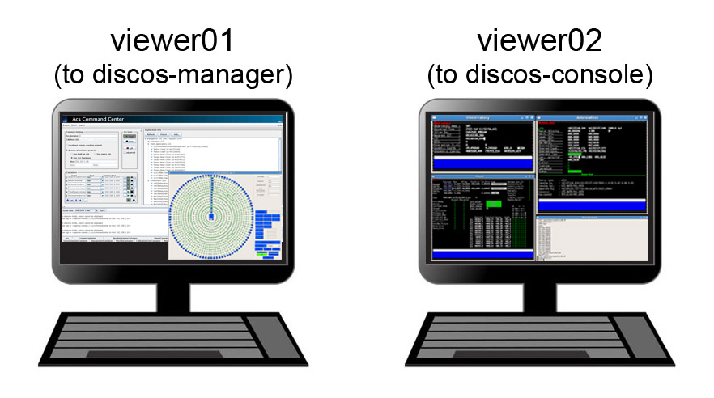

.. _discos-startup:

**************
DISCOS startup
**************

Login
=====

 
.. note:: **passwords are provided by the project friend**. As the control room logistics 
   might be updated, be sure to contact the project friend before your session 
   starts, in order to get the latest information. 

What to use viewer01 for
========================

This machine is accessed to manage the ACS Command Center and the Active Surface
GUI. Under ordinary conditions it is used to monitor the AS status, plus it 
is to be accessed to reboot discos/ACS when needed.  
You can login with::

    username: discos       pwd:  **********

What to use viewer02 for
========================

Observations take place using the **viewer02** machine, 
in turn exploiting a VNC connection to the **discos-console** machine.
 
You can login with::

    username: observer       pwd:  **********

If VNC is not active, open a terminal and use the vncStart command, which is going to 
connect to the **discos-console** machine. 

    login: observer     pwd: **********

The VNC desktop might be larger than the monitor; you can scroll horizontally 
using the bottom scrollbar. Beware that, when launching programs, they might 
open windows in the invisible desktop area! 

Once logged in on discos-console, *you should find the input terminal and all the 
monitors already running*. If this is not the case, open a new terminal, then::

    $  discosConsole 

This command opens 9 panels at once: 

	* **operatorInput** - terminal for command line input
	* **AntennaBoss** 
	* **GenericBackend**
	* **Mount**  
	* **Observatory** 
	* **Receivers**
	* **Scheduler**
	* **MinorServo**
        * **ACS Custom Logger**

Rearrange the panels on the desktop according to your preferences. 
In case any of them does not automatically start, or if you close
any of them by accident, you can manually open them 
by means of individual command lines, to be given in the open terminal::

   $ operatorInput
   $ antennaBossTui 
   $ genericBackendTui BACKENDS/TotalPower  (or XARCOS, or SARDARA)
   $ mountTui 
   $ observatoryTui 
   $ receiversBossTui
   $ schedulerTui
   $ minorservoBossTui
   $ loggingDisplay        
    
    
All the antenna/receiver/backend setup procedures are performed via the 
operatorInput window, which is also used to start/stop the schedules. 

The other panels are monitors used to display a vast amount of information, 
see :ref:`Appendix-A-Monitor-panels-full-description` and 
:ref:`Appendix-B-Complete-command-list` for a comprehensive description of 
their content and a list of all the commands available for the operatorInput 
(they can be inserted in schedules as well).

   
The operatorInput panel supports "TAB-completion".
For example (op):: 

    > f<TAB> 
    flush      flushAll     focusScan

    > fo<TAB> 
    > focusScan 

Online help is available:: 

    > help(focusScan)

       focusScan=span,duration
       commands a focus scan on a previously selected target
       (by means of the track or sidereal commands).
       Parameters:

       * span: the length run on the z-axis expressed in mm,
       * duration: the time length espressed in hh:mm:ss,

       e.g. > focusScan=60,00:01:00

TAB-completion is active for the online help as well::

     > help(fo<TAB>
     > help(focusScan

The help() command shows the complete command list::

    > help()

       antennaPark
       antennaReset
       antennaSetup
       ...
       tsys
       wait
       wx

.. note:: **discos-console** is also the location where users need to
copy their schedules to, and where they can retrieve their data from. 
See section XXX for details.